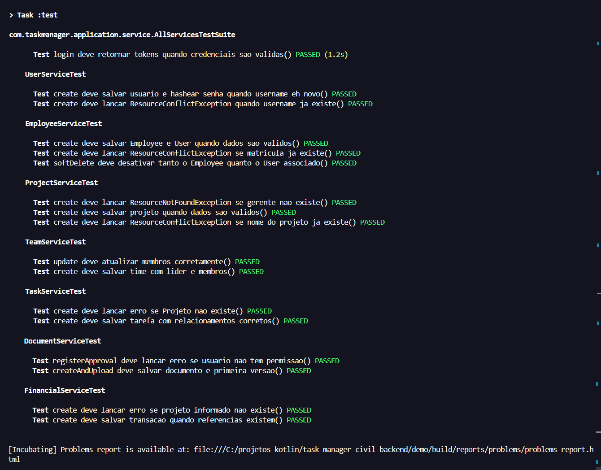

## 🔧 Testes Unitários - Camada de Serviço
Abaixo está a lista organizada dos Testes Unitários da Camada de Serviço que implementamos. Eles cobrem as regras de negócio críticas, validações de integridade e tratamento de exceções.

---

### 🧪 Catálogo de Testes Unitários (Service Layer)

#### 1. Autenticação (`AuthServiceTest`)
* **Login com Sucesso:** Verifica se, ao fornecer credenciais válidas, o sistema retorna corretamente o `accessToken` e o `refreshToken`.

#### 2. Usuários (`UserServiceTest`)
* **Bloqueio de Duplicidade:** Valida se o sistema lança `ResourceConflictException` ao tentar criar um usuário com um *username* que já existe.
* **Criação e Hash:** Verifica se um novo usuário é salvo corretamente e se a senha é criptografada (hash) antes da persistência.

#### 3. Colaboradores (`EmployeeServiceTest`)
* **Criação em Cascata:** Valida se, ao criar um Colaborador, o sistema cria e persiste simultaneamente a entidade `User` (login) e a entidade `Employee` (dados de RH).
* **Unicidade de Matrícula:** Verifica se o sistema impede o cadastro de dois colaboradores com a mesma matrícula funcional (`ResourceConflictException`).
* **Soft Delete em Cascata:** Garante que, ao desativar um colaborador, o usuário de login associado também seja desativado (`isActive = false`).

#### 4. Projetos (`ProjectServiceTest`)
* **Criação Válida:** Confirma se o projeto é salvo corretamente com o vínculo ao Gerente (`Employee`) informado.
* **Nome Único:** Verifica se o sistema bloqueia a criação de dois projetos com o mesmo nome.
* **Validação de Gerente:** Assegura que o sistema lança erro (`ResourceNotFoundException`) se o ID do gerente informado não existir.

#### 5. Equipes (`TeamServiceTest`)
* **Criação de Time:** Valida se a equipe é criada corretamente, associando o Líder e a lista de Membros fornecida.
* **Atualização de Membros:** Verifica a lógica de atualização (`UPDATE`), garantindo que a lista de membros seja substituída corretamente pelos novos IDs fornecidos.

#### 6. Tarefas (`TaskServiceTest`)
* **Criação com Relacionamentos:** Valida se a tarefa é salva com todas as chaves estrangeiras corretas: Projeto, Responsável (*Assignee*) e Criador (*Reporter*).
* **Integridade Referencial:** Verifica se o sistema impede a criação da tarefa caso o ID do Projeto informado não exista (`ResourceNotFoundException`).

#### 7. Documentos (`DocumentServiceTest`)
* **Upload e Versionamento:** Simula o envio de um arquivo e verifica se o sistema cria o registro pai (`Document`) e a primeira versão (`DocumentVersion` v1).
* **Permissão de Aprovação:** Valida a regra de negócio que impede usuários sem a role `GESTOR_OBRAS` de aprovar ou rejeitar documentos técnicos.

#### 8. Financeiro (`FinancialServiceTest`)
* **Registro Financeiro:** Confirma se uma transação (receita/despesa) é salva corretamente com vínculo ao Projeto.
* **Validação de Projeto:** Garante que não é possível lançar um custo para um projeto inexistente.

---

### ▶️ Executando os Testes
Para executar todos os testes unitários da camada de serviço em sequência, utilize a suíte de testes que configuramos. No terminal, na raiz do projeto, rode o comando:

```bash
./gradlew test --tests "com.taskmanager.application.service.AllServicesTestSuite"
```

Isso acionará o JUnit 5 para executar automaticamente todos os arquivos de teste listados na suíte (Auth, User, Employee, Project, Team, Task, Document e Financial), apresentando os logs detalhados de cada validação no console.

---

### ✅ Resultado dos Testes

