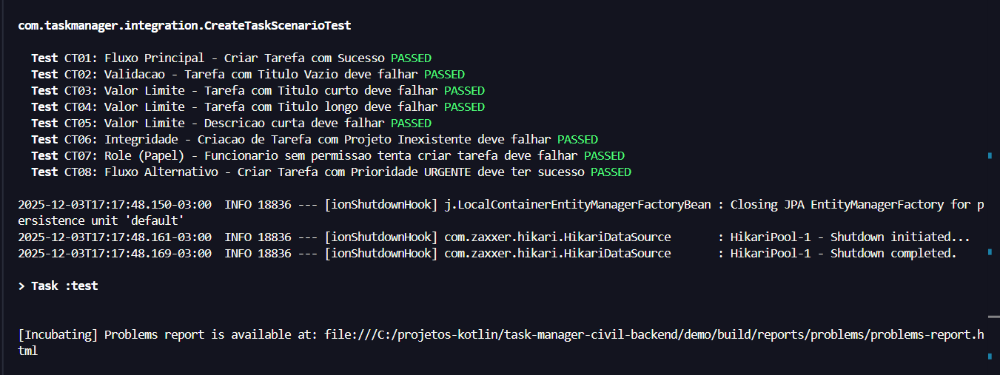

# 🔧 Testes de Integração - Casos de Teste
Um teste de integração é um tipo de teste de software que verifica como diferentes módulos ou componentes de um sistema funcionam juntos. \
Este é o [arquivo responsável por testar os Casos de Teste do sistema](CreateTaskScenarioTest.kt)

## 🔎 Casos de Teste
- **CT01**: Tarefa criada com sucesso via fluxo principal;
- **CT02**: Validação de título vazio funcionou corretamente (400 Bad Request);
- **CT03**: Validação de título curto funcionou corretamente (400 Bad Request);
- **CT04**: Validação de título longo (>200) funcionou corretamente (400 Bad Request);
- **CT05**: Validação de descrição curta funcionou corretamente (400 Bad Request);
- **CT06**: Validação de integridade (Projeto inexistente) funcionou (404 Not Found);
- **CT07**: Bloqueio de permissão para funcionário funcionou (403 Forbidden);
- **CT08**: Tarefa com prioridade CRÍTICA criada com sucesso.

## ✅ Resultado dos Testes

